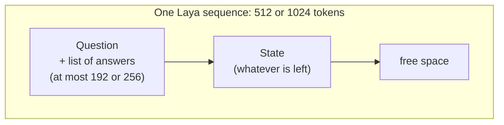
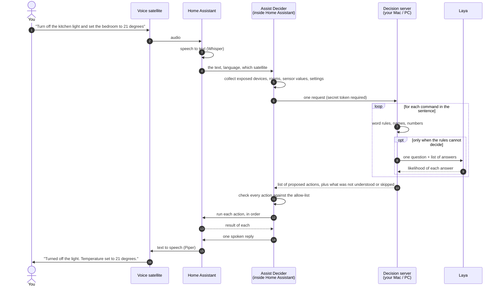
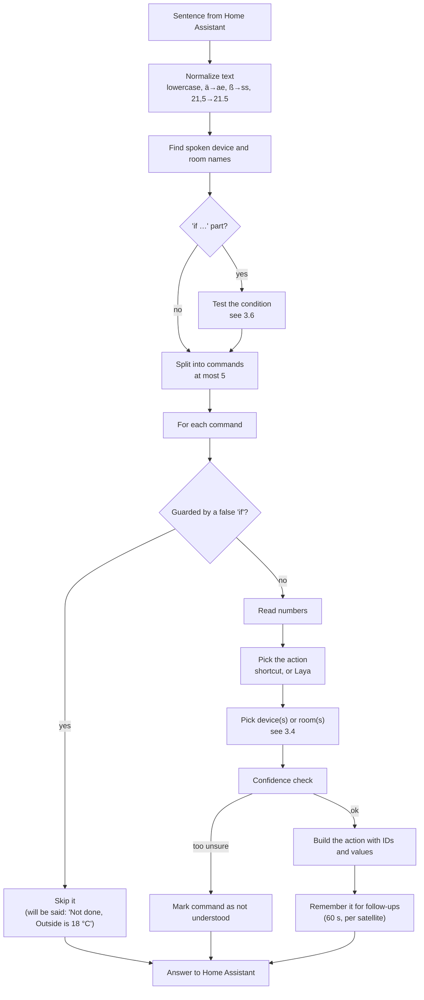
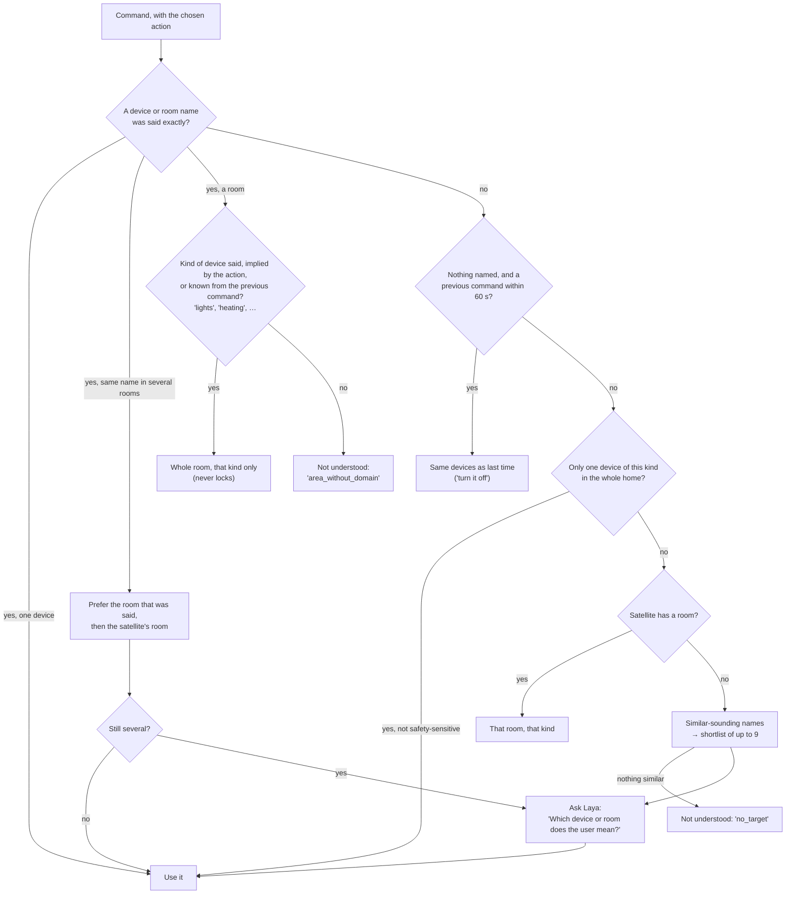
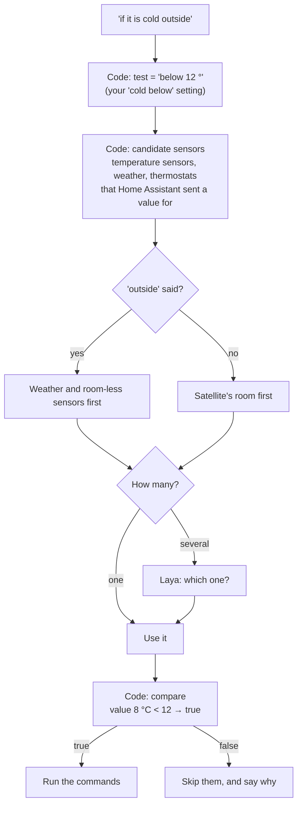
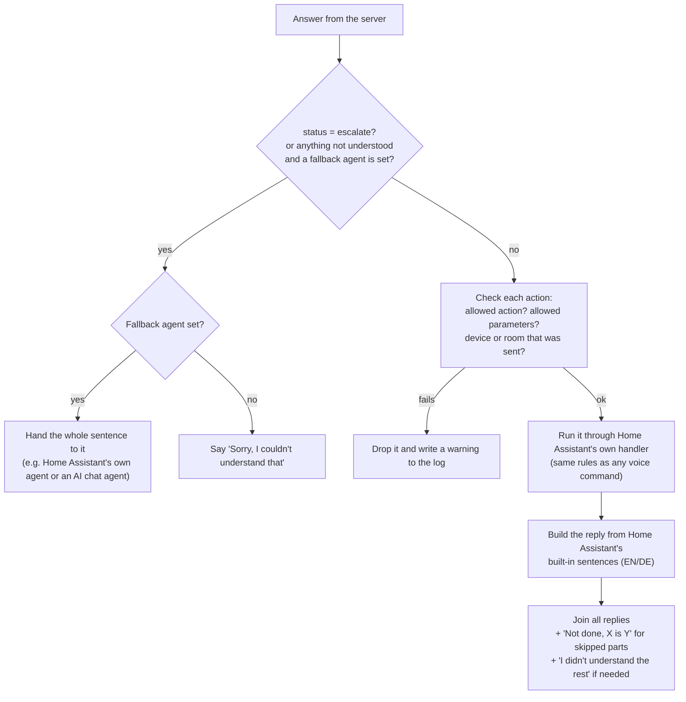
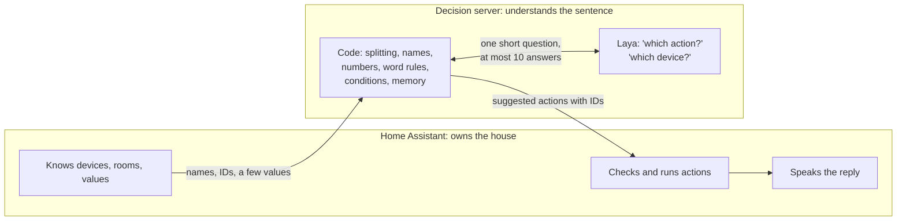

# How Assist Decider talks to Home Assistant and Laya

This explains, in plain words:

1. [What Home Assistant can do by voice](#1-what-home-assistant-can-do-by-voice): the kinds of things it controls, the actions it knows, and the values each action accepts.
2. [How much Laya can read at once](#2-how-much-laya-can-read-at-once), and what takes up that space.
3. [What happens when you speak](#3-what-happens-when-you-speak): who decides what, what goes into each Laya call, what comes out, and what happens to it.

Everything here was checked against the code in this repo, Home Assistant 2026.9.4 and `laya==0.3.26`.

---

## A few words first

| Word | What it means here |
|---|---|
| **Entity** | One thing Home Assistant can see or control: a lamp, a plug, a thermostat, a temperature sensor. Each has an ID such as `light.kitchen` and a friendly name such as "Kitchen Light". |
| **Kind** (Home Assistant calls it *domain*) | The part of the ID before the dot: `light`, `switch`, `cover`… It says what sort of thing it is. |
| **Sub-kind** (*device class*) | A finer label inside a kind. A `cover` can be a `blind`, `garage`, `window`…; a `binary_sensor` can be a `door`, `motion`… |
| **Area** | A room. **Floor** is a group of rooms. |
| **Exposed** | You ticked "allow voice assistants to see this" in Home Assistant. Nothing else is ever sent or controlled. |
| **Action** (Home Assistant calls it *intent*) | A named thing Home Assistant knows how to do, such as `HassTurnOn`. |
| **Parameter** (Home Assistant calls it *slot*) | A value an action needs: which device, which room, what brightness. |
| **Laya** | A small AI model. You give it a question plus a fixed list of answers, and it says how likely each answer is. It cannot write text, read numbers well or invent answers. |
| **Token** | A word piece. Laya counts text in tokens. One English word is about 1–1.5 tokens, a long German word can be 3–5. |

---

## 1. What Home Assistant can do by voice

### 1.1 Kinds of things

Home Assistant has many kinds of entities. These are the ones voice actions work with. "Used today" means Assist Decider can already produce actions for them.

| Kind | What it is | Typical sub-kinds | Used today |
|---|---|---|---|
| `light` | Lamps, LED strips | – | ✅ on/off, brightness |
| `switch` | Plugs, relays | `outlet`, `switch` | ✅ on/off |
| `input_boolean` | A virtual on/off switch you made in Home Assistant | – | ✅ on/off |
| `fan` | Fans | – | ✅ on/off (speed not yet) |
| `cover` | Blinds, shutters, curtains, garage doors, gates | `awning`, `blind`, `curtain`, `damper`, `door`, `garage`, `gate`, `shade`, `shutter`, `window` | ✅ open/close, position |
| `valve` | Water and gas valves, sprinklers | `water`, `gas` | ✅ open/close, position |
| `lock` | Door locks | – | ✅ lock/unlock, **only by exact name** |
| `climate` | Thermostats, heating, air conditioning | – | ✅ on/off, set temperature, ask temperature |
| `media_player` | TVs, speakers | `tv`, `speaker`, `receiver` | ✅ on/off (pause, volume… not yet) |
| `humidifier` | Humidifiers, dehumidifiers | `humidifier`, `dehumidifier` | ✅ on/off (level and mode not yet) |
| `scene` | A saved set of device settings | – | ✅ turn on |
| `script` | A saved sequence of steps | – | ✅ turn on |
| `automation` | A rule that runs by itself | – | ✅ on/off |
| `sensor` | Measures something: temperature, humidity, power… | `temperature`, `humidity`, `power`… | ✅ ask state, use in "if…" |
| `binary_sensor` | A yes/no sensor: door open, motion seen | `door`, `window`, `motion`, `opening`… | ✅ ask state, use in "if…" |
| `weather` | Weather forecast | – | ✅ outside temperature in "if…" |
| `vacuum` | Robot vacuums | – | ❌ |
| `lawn_mower` | Robot mowers | – | ❌ |
| `todo` | To-do and shopping lists | – | ❌ |
| `alarm_control_panel` | Alarm systems | – | ❌, and never guessed |

Locks, alarm panels and covers of sub-kind `garage`, `gate` or `door` are **safety-sensitive**. Assist Decider only acts on them when you say their exact name or alias. They are never guessed and never included in a "whole room" command.

### 1.2 What is sent about each thing

Home Assistant sends the decision server only names and IDs, never a full picture of your home:

| For | Sent | Limits |
|---|---|---|
| Each exposed entity | ID, friendly name, up to 10 aliases, room ID, sub-kind | up to 3000 entities; names up to 100 characters |
| Each area | ID, name, up to 10 aliases, floor ID | up to 500 areas |
| Each floor | ID, name, up to 10 aliases | up to 50 floors |
| Current values | **Only** sensor values, yes/no sensor values, weather temperature and thermostat current temperature. Used for "if…" sentences. | up to 3000 values, 255 characters each |

Lights being on or off, lock states and anything else are **not** sent.

### 1.3 Every voice action Home Assistant has

Most actions that control a device share the same **"which device" parameters**:

| Parameter | Type | Meaning |
|---|---|---|
| `name` | text | One device, by name. |
| `area` | text | A room. |
| `floor` | text | A floor. |
| `domain` | list of text | Only this kind, e.g. `["light"]`. |
| `device_class` | list of text | Only this sub-kind, e.g. `["blind"]`. |
| `preferred_area_id` / `preferred_floor_id` | text | The room/floor the voice satellite is in. Used to break ties. |

At least one of `name`, `area` or `floor` is required, unless stated otherwise below.

#### Actions Assist Decider produces today

| Action | What it does | Its own parameters | Type and range | Notes |
|---|---|---|---|---|
| `HassTurnOn` | Turn on, open, activate. **Locks a lock.** Runs a scene or script. | – | – | |
| `HassTurnOff` | Turn off, close, deactivate. **Unlocks a lock.** | – | – | |
| `HassLightSet` | Change a light | `brightness` | whole number 0–100 (percent) | `color` (a colour name) and `temperature` (kelvin, positive whole number) also exist. Not used yet. |
| `HassClimateSetTemperature` | Set the target temperature | `temperature` | any decimal number in Home Assistant. **We only send 0–100, rounded to the nearest 0.5.** | `name`/`area`/`floor` are optional. Without them Home Assistant picks the thermostat. |
| `HassSetPosition` | Move a cover or valve | `position` | whole number 0–100 (percent open) | |
| `HassGetState` | Ask about a device | `state` (optional) | list of text, e.g. `["on"]` | Home Assistant also accepts area + kind ("are any lights on in the kitchen?"). We only send one named device for now. |
| `HassClimateGetTemperature` | Ask how warm it is | – | – | Device and room are optional. |

#### Actions Home Assistant has that we do not produce yet

| Action | What it does | Its own parameters (type, range) |
|---|---|---|
| `HassToggle` | Flip on ↔ off | – |
| `HassStopMoving` | Stop a cover or valve | – |
| `HassFanSetSpeed` | Fan speed | `percentage`: whole number 0–100 |
| `HassSetVolume` | Volume | `volume_level`: whole number 0–100 |
| `HassSetVolumeRelative` | Louder/quieter | `volume_step`: `"up"`, `"down"` or a whole number −100 to 100 |
| `HassMediaPause` / `HassMediaUnpause` / `HassMediaNext` / `HassMediaPrevious` | Media controls | – |
| `HassMediaPlayerMute` / `HassMediaPlayerUnmute` | Mute | `is_volume_muted`: yes/no (optional) |
| `HassMediaSearchAndPlay` | "Play some jazz" | `search_query`: **free text**; `media_class`: one of Home Assistant's media types (optional) |
| `HassHumidifierSetpoint` | Humidity target | `name` (required); `humidity`: whole number 0–100 |
| `HassHumidifierMode` | Humidifier mode | `name` (required); `mode`: text |
| `HassVacuumStart` / `HassVacuumReturnToBase` | Vacuum | – |
| `HassVacuumCleanArea` | Vacuum one room | `area` (required) |
| `HassLawnMowerStartMowing` / `HassLawnMowerDock` | Mower | – |
| `HassStartTimer` | Start a timer | at least one of `hours`, `minutes`, `seconds`: positive whole numbers; `name`: text (optional); `conversation_command`: **free text** (optional) |
| `HassCancelTimer`, `HassPauseTimer`, `HassUnpauseTimer`, `HassTimerStatus` | Timer control | which timer: `start_hours`/`start_minutes`/`start_seconds` (positive whole numbers), `name` or `area` (text) |
| `HassIncreaseTimer` / `HassDecreaseTimer` | Add or remove time | `hours`/`minutes`/`seconds` plus which timer, as above |
| `HassCancelAllTimers` | Cancel all timers | `area` (optional) |
| `HassGetCurrentTime` / `HassGetCurrentDate` | Time and date | – |
| `HassGetWeather` | Weather | `name` (optional) |
| `HassListAddItem` / `HassListCompleteItem` / `HassListRemoveItem` | To-do lists | `item`: **free text**; `name`: list name |
| `HassShoppingListAddItem` / `HassShoppingListCompleteItem` / `HassShoppingListLastItems` | Shopping list | `item`: **free text** |
| `HassBroadcast` | Announce on all speakers | `message`: **free text** |
| `HassNevermind` | "Never mind" | – |
| `HassRespond` | Just say something | `response`: text |

Anything marked **free text** needs words copied out of your sentence. Laya can only pick from a list, so these need a different tool (see PLAN.md, "Later").

### 1.4 What Home Assistant lets the server ask for

Home Assistant does not trust the server. It only runs actions from this allow-list, with these parameters, and only for devices and rooms it sent:

| Action | Parameters allowed |
|---|---|
| `HassTurnOn`, `HassTurnOff` | `name`, `area`, `domain` |
| `HassLightSet` | `name`, `area`, `domain`, `brightness` |
| `HassClimateSetTemperature` | `name`, `area`, `temperature` |
| `HassSetPosition` | `name`, `area`, `domain`, `position` |
| `HassGetState` | `name`, `area`, `domain`, `state` |
| `HassClimateGetTemperature` | `name`, `area` |

The server always sends **IDs** (`light.kitchen`, `kitchen`), never free names, so there is no doubt which device is meant.

---

## 2. How much Laya can read at once

### 2.1 The short answer

- Every Laya call reads **one sequence of tokens**. It has a fixed maximum length:

  | Checkpoint | Whole sequence | Of which, at most for the question and its answers | Each answer, at most |
  |---|---|---|---|
  | `english` | **512 tokens** | 192 tokens | 48 tokens |
  | `multilingual` | **1024 tokens** | 256 tokens | 48 tokens |

  (Both underlying models could read 8192 tokens, but Laya was trained with these limits and sets them in its config.)

- **Yes, the question fills the same space as the state.** The question and its list of answers go in first. The state gets whatever is left. If the state is too long, its end is cut off silently.
- **Each question is read on its own.** Two questions do not add up. Laya also keeps no memory between calls. Remembering the previous sentence ("turn *it* off") is done by our server code, not by Laya.

### 2.2 What one sequence looks like

```
[start] choice question: Which smart home action does the user ask for? [sep]
  [answer] turn_on: turn on, switch on, open or activate a device
  [answer] turn_off: turn off, switch off, close or deactivate a device
  [answer] set_brightness: change the brightness of a light, dim
  … one line per answer …
  [answer] none: something else, not a smart home command [sep]
{"utterance": "turn off the kitchen light"} [sep]
```

Laya scores each `[answer]` marker. The part after the last `[sep]` is the **state**: what the question is about.



### 2.3 What we actually put in

We keep the state tiny on purpose. **The list of your devices is never put into the state.** At most 9 candidate devices or rooms appear, and only as answers in the "which device?" question.

| Question | State we send | Answers |
|---|---|---|
| Which action? | `{"utterance": "<one command>"}` | the 7 actions + "none" |
| Which device or room? | `{"utterance": "<one command>", "room": "<satellite's room>"}` | up to 9 candidates + "none" |
| Which sensor? (for "if…") | same as above | up to 9 sensors + "none" |

Measured with the real tokenizers (9 device candidates with typical names):

| Checkpoint | Language | Question | Question + answers | State | Total used | Limit |
|---|---|---|---|---|---|---|
| english | EN | which action | 128 | 18 | 147 | 512 |
| english | EN | which device | 147 | 18 | 166 | 512 |
| multilingual | EN | which action | 125 | 18 | 144 | 1024 |
| multilingual | EN | which device | 147 | 18 | 166 | 1024 |
| multilingual | DE | which action | 130 | 22 | 153 | 1024 |
| multilingual | DE | which device | 147 | 22 | 170 | 1024 |

So we use roughly **15–30 %** of the space. The tightest limit is the 192-token cap for the question and answers on the `english` checkpoint. With 9 candidates that have very long names (≈ 15+ words each), Laya would shorten every answer to an equal share and they could start to look alike. That is one reason we stop at 10 answers.

---

## 3. What happens when you speak

### 3.1 The whole trip



The server can **only suggest**. It has no password for Home Assistant. Home Assistant checks every suggestion again and runs it with the normal voice-assistant rules.

### 3.2 Who decides what

| Decision | Who decides | How |
|---|---|---|
| Where one command ends and the next begins | **Code** | Split at "and", "then", commas… but only if the next part has its own verb. "Turn off the kitchen **and** hallway lights" stays one command with two rooms. |
| Is there an "if…" part, and what does it test? | **Code** | Words like "if/wenn", then "cold", "warm", "below 5", "open", "closed"… |
| Which numbers were said | **Code** | "einundzwanzig komma fünf Grad" → 21.5 °. "fifty percent" → 50 %. |
| Which device or room names were said | **Code** | Exact match against names and aliases, including German compounds ("Wohnzimmerlicht" → room "Wohnzimmer"). |
| Which actions are **not** possible | **Code** | "Word rules". "off" said → "turn on" is ruled out. A question ("is…?") → only ask-actions. A number with % or ° said → plain on/off ruled out. No number said → "set brightness" ruled out. |
| Which action | **Laya**, unless a shortcut applies | Shortcuts: a follow-up with no verb reuses the last action ("and the hallway too"); a question naming a device is always "ask state". |
| Which device or room | **Code first, Laya last** | See 3.4. |
| Which sensor an "if…" refers to | **Code first, Laya if several fit** | |
| Is the "if…" true? | **Code** | Compares the number or on/off value Home Assistant sent. Laya never reads values. |
| Is Laya sure enough? | **Code** | Confidence check, see 3.5. |
| The values sent with the action (brightness, temperature…) | **Code** | From the numbers it found. Laya never picks numbers. |
| May this action run on this device? | **Home Assistant** | Allow-list check, then Home Assistant's own exposure check. |
| What to say back | **Home Assistant** | Its own built-in reply sentences, in English or German. |
| What to do with anything not understood | **Home Assistant** | Hand the whole sentence to a fallback agent you chose, or say "Sorry, I couldn't understand that". |

### 3.3 Inside the server, step by step



### 3.4 How the device or room is chosen

The server tries cheap and certain ways first. Laya is the last resort.



### 3.5 One Laya call, in and out

**In** (what the server passes to Laya for "which action?"):

```json
{
  "state": {"utterance": "turn off the kitchen light"},
  "questions": {
    "intent": {
      "type": "choice",
      "instructions": "Which smart home action does the user ask for?",
      "criteria": {
        "turn_on": "turn on, switch on, open or activate a device",
        "turn_off": "turn off, switch off, close or deactivate a device",
        "set_brightness": "change the brightness of a light, dim",
        "set_temperature": "set the target temperature of heating or thermostat",
        "set_position": "move a blind, shutter or cover to a position",
        "get_state": "ask about the current state of a device",
        "get_temperature": "ask how warm or cold it is",
        "none": "something else, not a smart home command"
      }
    }
  },
  "lang": "en"
}
```

Only actions that Home Assistant has, and that have at least one exposed device, are listed. German uses German questions and descriptions.

**In** (for "which device?"):

```json
{
  "state": {"utterance": "turn on the lamp", "room": "Living Room"},
  "questions": {
    "target": {
      "type": "choice",
      "instructions": "Which device or room does the user mean?",
      "criteria": {
        "e1": "Floor Lamp (light) in Living Room",
        "e2": "Desk Lamp (light) in Office",
        "a3": "Living Room (whole room)",
        "none": "none of these"
      }
    }
  }
}
```

**Out** (Laya always answers like this):

```json
{"intent": {"choice": "turn_off",
            "probabilities": {"turn_on": 0.03, "turn_off": 0.91, "set_brightness": 0.01, "…": "…", "none": 0.01}}}
```

**What the server does with it:**

1. **Removes ruled-out answers.** Laya always sees the full list, because it gets worse when answers are removed. Afterwards, answers ruled out by the word rules are dropped and the rest are scaled back up to 100 %.
2. **Takes the most likely answer.**
3. **Computes how sure it is.** 0 means "no better than a random pick", 1 means "certain":
   `confidence = (number of answers × top likelihood − 1) ÷ (number of answers − 1)`.
   Example: 8 answers, top one at 60 % → (8 × 0.6 − 1) ÷ 7 = **0.54**.
4. **Checks it.** If "none" won, or the confidence is below your threshold (default **0.4** English, **0.5** German), this command is marked as not understood.
5. **Records everything** for the live log page: all likelihoods, what was ruled out and why, the time taken.

A command usually needs **0, 1 or 2** Laya calls. One call takes about **15–40 ms** on an Apple M-series GPU. The server runs one call at a time. If more than 4 requests are waiting, it answers "busy".

### 3.6 "If …" sentences

> "If it is cold outside, set the heating to 24 and open the blinds"



Tests the code understands: cold, warm, below *N*, above *N*, open/on, closed/off. One condition per sentence.

### 3.7 What the server sends back

```json
{
  "status": "ok",
  "actions": [
    {"intent": "HassTurnOff", "slots": {"name": "light.kitchen"},
     "segment": "Turn off the kitchen light", "confidence": 1.0},
    {"intent": "HassClimateSetTemperature", "slots": {"area": "bedroom", "temperature": 21.0},
     "segment": "set the bedroom to 21 degrees", "confidence": 0.87}
  ],
  "unresolved": [],
  "skipped": [],
  "reason": null,
  "trace_id": "3f9a1c2b7d10",
  "elapsed_ms": 42.3
}
```

| Field | Meaning | Limits |
|---|---|---|
| `status` | `ok` if at least one action was found or skipped, otherwise `escalate` ("I give up") | |
| `actions` | What to run, in order. `slots` are the parameters, always with IDs. `confidence` is the lowest of the Laya answers behind it, 1.0 if Laya was not asked. | up to 10 actions, 12 parameters each |
| `unresolved` | Parts of the sentence that were not understood | up to 10 |
| `skipped` | Parts not run because the "if" was false, plus the sensor and its value | up to 10 |
| `reason` | Why something was not understood, see below | |
| `trace_id`, `elapsed_ms` | For finding the request in the live log | |

**Reasons**, in plain words:

| Reason | Meaning |
|---|---|
| `low_confidence` | Laya was not sure enough. |
| `none_chosen` | Laya said it is not a smart-home command. |
| `no_target` | No matching device or room. |
| `area_without_domain` | A room was named but not what kind of device ("turn off the kitchen"). |
| `area_not_supported` | This action needs one device, not a room. |
| `missing_value` | "Dim the light", but no number was said. |
| `no_intent` | The word rules ruled out every action. |
| `condition_unknown` | The "if…" part could not be matched to a sensor or test. |
| `too_many_segments` | More than 5 commands in one sentence. |
| `unsupported_language` | The loaded model does not speak this language. |
| `no_exposed_entities` | Nothing is exposed to voice assistants. |

### 3.8 What Home Assistant does with the answer



If the server cannot be reached, does not answer within **10 seconds**, or rejects the token, Home Assistant says "the decision server is not reachable", or uses the fallback agent if one is set. A rejected token also asks you to enter a new one.

### 3.9 What Home Assistant sends to the server

| Field | Meaning | Type and limits |
|---|---|---|
| `protocol_version` | Must match on both sides | always `2` |
| `text` | What you said | 1–500 characters |
| `language` | | `en` or `de` |
| `satellite_area_id` | Room of the satellite you spoke to | room ID, optional |
| `context_id` | A scrambled ID of the satellite (or chat). Used to remember the last command. | 1–64 characters, optional |
| `intents` | Which actions this Home Assistant has | up to 300 names |
| `home` | Exposed devices, rooms, floors (see 1.2) | |
| `states` | Sensor values for "if…" (see 1.2) | |
| `options.confidence_threshold` | How sure Laya must be | 0–1; default 0.4 EN, 0.5 DE |
| `options.memory_seconds` | How long "turn it off" refers to the last command | 0–3600; default 60; 0 = off |
| `options.cold_below` / `warm_above` | What "cold"/"warm" mean | −100 to 200; default 12 / 20, in your temperature unit |

Every request must carry the secret token, and the server checks it before reading anything else. Unknown fields are refused.

---

## 4. In one picture



- **Home Assistant** knows the house and has the final say.
- **Code on the server** does everything that has a clear rule: splitting sentences, matching names, reading numbers, testing conditions, remembering the last command.
- **Laya** answers only two kinds of multiple-choice question: which action, and which device or room, when the rules cannot tell. It reads one short command at a time and never sees your whole home.
