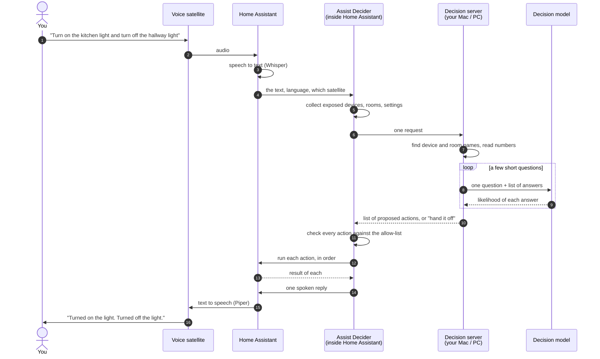
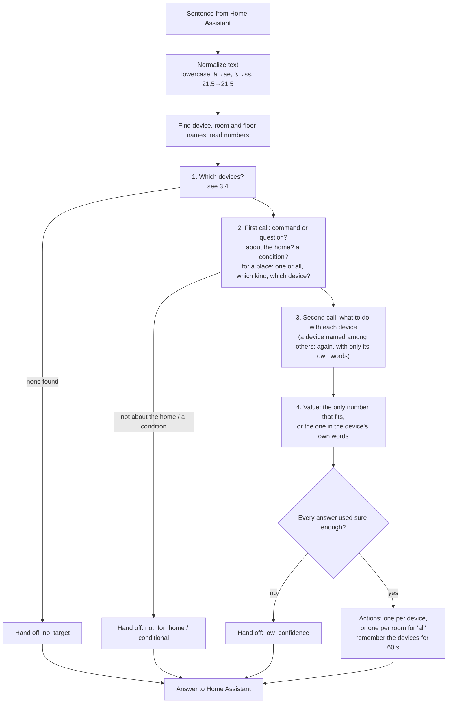
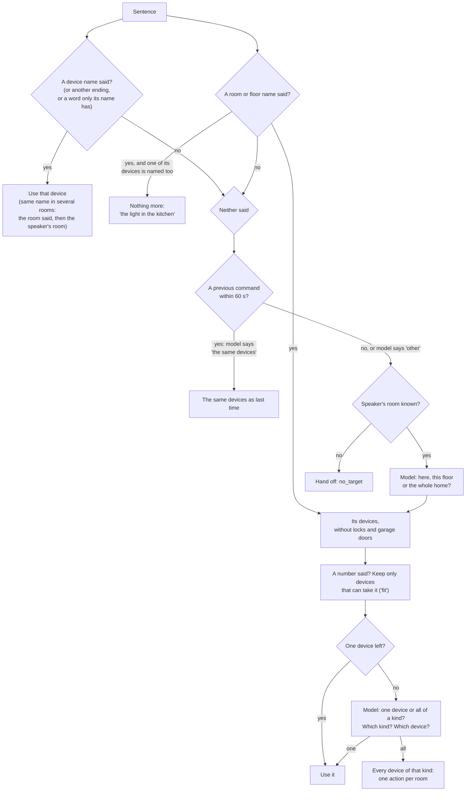
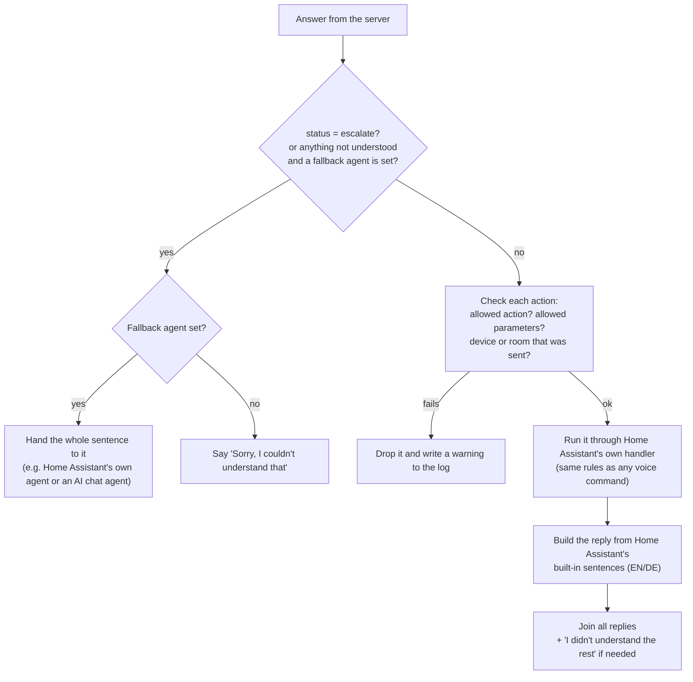
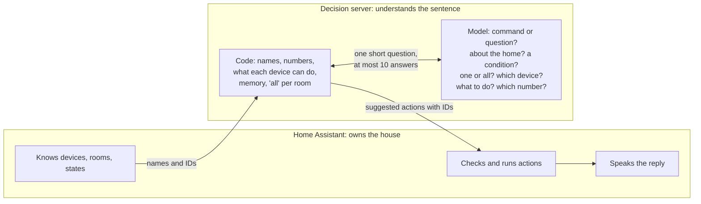

# How Assist Decider works

This explains, in plain words:

1. [What Home Assistant can do by voice](#1-what-home-assistant-can-do-by-voice): the kinds of things it controls, the actions it knows, and the values each action accepts.
2. [What the model is asked](#2-what-the-model-is-asked): the questions, and how much the model can read at once.
3. [What happens when you speak](#3-what-happens-when-you-speak): who decides what, step by step, and what goes back to Home Assistant.

Everything here was checked against the code in this repo and Home Assistant 2026.9.4. How well each model does with it is in [BENCHMARK.md](BENCHMARK.md).

---

## A few words first

| Word | What it means here |
|---|---|
| **Entity** | One thing Home Assistant can see or control: a lamp, a plug, a thermostat, a temperature sensor. Each has an ID such as `light.kitchen` and a friendly name such as "Kitchen Light". |
| **Kind** (Home Assistant calls it *domain*) | The part of the ID before the dot: `light`, `switch`, `cover`… It says what sort of thing it is. |
| **Sub-kind** (*device class*) | A finer label inside a kind. A `cover` can be a `blind`, `garage`, `window`…; a `binary_sensor` can be a `door`, `motion`… |
| **Area** | A room. **Floor** is a group of rooms. |
| **Exposed** | You ticked "allow voice assistants to see this" in Home Assistant. Nothing else is ever sent or controlled. |
| **Action** (Home Assistant calls it *intent*) | A named thing Home Assistant knows how to do, such as `HassTurnOn`. |
| **Parameter** (Home Assistant calls it *slot*) | A value an action needs: which device, which room, what brightness. |
| **Decision model** | A small AI model, such as Intern-Decision or Laya. You give it a question plus a fixed list of answers, and it says how likely each answer is. It cannot write text or invent answers. |
| **Confidence** | How sure the model is about an answer: 0 is a pure guess, 1 is certain. |
| **Token** | A word piece. Models count text in tokens. One English word is about 1–1.5 tokens, a long German word can be 3–5. |

---

## 1. What Home Assistant can do by voice

### 1.1 Kinds of things

Home Assistant has many kinds of entities. These are the ones voice actions work with. "Used today" means Assist Decider can already produce actions for them.

| Kind | What it is | Typical sub-kinds | Used today |
|---|---|---|---|
| `light` | Lamps, LED strips | – | ✅ on/off, brightness |
| `switch` | Plugs, relays | `outlet`, `switch` | ✅ on/off |
| `input_boolean` | A virtual on/off switch you made in Home Assistant | – | ✅ on/off |
| `fan` | Fans | – | ✅ on/off (speed not yet) |
| `cover` | Blinds, shutters, curtains, garage doors, gates | `awning`, `blind`, `curtain`, `damper`, `door`, `garage`, `gate`, `shade`, `shutter`, `window` | ✅ open/close, position |
| `valve` | Water and gas valves, sprinklers | `water`, `gas` | ✅ open/close, position |
| `lock` | Door locks | – | ✅ lock/unlock, **only by its name** |
| `climate` | Thermostats, heating, air conditioning | – | ✅ on/off, set temperature, ask temperature |
| `media_player` | TVs, speakers | `tv`, `speaker`, `receiver` | ✅ on/off (pause, volume… not yet) |
| `humidifier` | Humidifiers, dehumidifiers | `humidifier`, `dehumidifier` | ✅ on/off (level and mode not yet) |
| `scene` | A saved set of device settings | – | ✅ turn on |
| `script` | A saved sequence of steps | – | ✅ turn on |
| `automation` | A rule that runs by itself | – | ✅ on/off |
| `sensor` | Measures something: temperature, humidity, power… | `temperature`, `humidity`, `power`… | ✅ ask state |
| `binary_sensor` | A yes/no sensor: door open, motion seen | `door`, `window`, `motion`, `opening`… | ✅ ask state |
| `weather` | Weather forecast | – | ✅ ask state |
| `vacuum` | Robot vacuums | – | ❌ |
| `lawn_mower` | Robot mowers | – | ❌ |
| `todo` | To-do and shopping lists | – | ❌ |
| `alarm_control_panel` | Alarm systems | – | ❌, and never guessed |

Locks, alarm panels and covers of sub-kind `garage`, `gate` or `door` are **safety-sensitive**. Assist Decider only acts on them when you say their name or alias (another word ending is fine: "gates" for "Gate"). When you name only a room or floor, they are never picked, and "all the covers" never includes them. Changing one also needs the model to be sure (see 3.5).

### 1.2 What is sent about each thing

Home Assistant sends the decision server only names and IDs, never a full picture of your home:

| For | Sent | Limits |
|---|---|---|
| Each exposed entity | ID, friendly name, up to 10 aliases, room ID, sub-kind | up to 3000 entities; names up to 100 characters |
| Each area | ID, name, up to 10 aliases, floor ID | up to 500 areas |
| Each floor | ID, name, up to 10 aliases | up to 50 floors |

**No states are sent**: not whether a light is on, not lock states, not sensor values.

### 1.3 Every voice action Home Assistant has

Most actions that control a device share the same **"which device" parameters**:

| Parameter | Type | Meaning |
|---|---|---|
| `name` | text | One device, by name. |
| `area` | text | A room. |
| `floor` | text | A floor. |
| `domain` | list of text | Only this kind, e.g. `["light"]`. |
| `device_class` | list of text | Only this sub-kind, e.g. `["blind"]`. |
| `preferred_area_id` / `preferred_floor_id` | text | The room/floor the voice satellite is in. Used to break ties. |

At least one of `name`, `area` or `floor` is required, unless stated otherwise below.

#### Actions Assist Decider produces today

| Action | What it does | Its own parameters | Type and range | Notes |
|---|---|---|---|---|
| `HassTurnOn` | Turn on, open, activate. **Locks a lock.** Runs a scene or script. | – | – | |
| `HassTurnOff` | Turn off, close, deactivate. **Unlocks a lock.** | – | – | |
| `HassLightSet` | Change a light | `brightness` | whole number 0–100 (percent) | `color` (a colour name) and `temperature` (kelvin, positive whole number) also exist. Not used yet. |
| `HassClimateSetTemperature` | Set the target temperature | `temperature` | any decimal number in Home Assistant. **We only send 5–35 °C, rounded to the nearest 0.5.** | |
| `HassSetPosition` | Move a cover or valve | `position` | whole number 0–100 (percent open) | |
| `HassGetState` | Ask about a device | `state` (optional) | list of text, e.g. `["on"]` | Home Assistant also accepts area + kind ("are any lights on in the kitchen?"). We only send one named device for now. |
| `HassClimateGetTemperature` | Ask how warm it is | – | – | Used for every question about a thermostat. |

An action names **one device** (`name`), or, for "all the lights in the living room", **a room and a kind** (`area` + `domain`): one action per room, so Home Assistant says "Turned on the lights". A floor or the whole home becomes one action per room on it. When a room has a lock or garage door of that kind, its other devices are named one by one instead, so the sensitive one is never touched. Climate actions get only `area`: Home Assistant's climate intents take no `domain`.

#### Actions Home Assistant has that we do not produce yet

| Action | What it does | Its own parameters (type, range) |
|---|---|---|
| `HassToggle` | Flip on ↔ off | – |
| `HassStopMoving` | Stop a cover or valve | – |
| `HassFanSetSpeed` | Fan speed | `percentage`: whole number 0–100 |
| `HassSetVolume` | Volume | `volume_level`: whole number 0–100 |
| `HassSetVolumeRelative` | Louder/quieter | `volume_step`: `"up"`, `"down"` or a whole number −100 to 100 |
| `HassMediaPause` / `HassMediaUnpause` / `HassMediaNext` / `HassMediaPrevious` | Media controls | – |
| `HassMediaPlayerMute` / `HassMediaPlayerUnmute` | Mute | `is_volume_muted`: yes/no (optional) |
| `HassMediaSearchAndPlay` | "Play some jazz" | `search_query`: **free text**; `media_class`: one of Home Assistant's media types (optional) |
| `HassHumidifierSetpoint` | Humidity target | `name` (required); `humidity`: whole number 0–100 |
| `HassHumidifierMode` | Humidifier mode | `name` (required); `mode`: text |
| `HassVacuumStart` / `HassVacuumReturnToBase` | Vacuum | – |
| `HassVacuumCleanArea` | Vacuum one room | `area` (required) |
| `HassLawnMowerStartMowing` / `HassLawnMowerDock` | Mower | – |
| `HassStartTimer` | Start a timer | at least one of `hours`, `minutes`, `seconds`: positive whole numbers; `name`: text (optional); `conversation_command`: **free text** (optional) |
| `HassCancelTimer`, `HassPauseTimer`, `HassUnpauseTimer`, `HassTimerStatus` | Timer control | which timer: `start_hours`/`start_minutes`/`start_seconds` (positive whole numbers), `name` or `area` (text) |
| `HassIncreaseTimer` / `HassDecreaseTimer` | Add or remove time | `hours`/`minutes`/`seconds` plus which timer, as above |
| `HassCancelAllTimers` | Cancel all timers | `area` (optional) |
| `HassGetCurrentTime` / `HassGetCurrentDate` | Time and date | – |
| `HassGetWeather` | Weather | `name` (optional) |
| `HassListAddItem` / `HassListCompleteItem` / `HassListRemoveItem` | To-do lists | `item`: **free text**; `name`: list name |
| `HassShoppingListAddItem` / `HassShoppingListCompleteItem` / `HassShoppingListLastItems` | Shopping list | `item`: **free text** |
| `HassBroadcast` | Announce on all speakers | `message`: **free text** |
| `HassNevermind` | "Never mind" | – |
| `HassRespond` | Just say something | `response`: text |

Anything marked **free text** needs words copied out of your sentence. The models can only pick from a list, so these need a different tool (see PLAN.md, "Later").

### 1.4 What Home Assistant lets the server ask for

Home Assistant does not trust the server. It only runs actions from this allow-list, with these parameters, and only for devices and rooms it sent:

| Action | Parameters allowed |
|---|---|
| `HassTurnOn`, `HassTurnOff` | `name`, `area`, `domain` |
| `HassLightSet` | `name`, `area`, `domain`, `brightness` |
| `HassClimateSetTemperature` | `name`, `area`, `temperature` |
| `HassSetPosition` | `name`, `area`, `domain`, `position` |
| `HassGetState` | `name`, `area`, `domain`, `state` |
| `HassClimateGetTemperature` | `name`, `area` |

The server always sends **IDs** (`light.kitchen`, `kitchen`), never free names, so there is no doubt which device is meant.

---

## 2. What the model is asked

### 2.1 The questions

The model only ever answers multiple-choice questions about your sentence. The first four are asked about every sentence, in one call together with every other question that needs no other answer:

| Question | When it is asked | Answers offered |
|---|---|---|
| "Is the user giving a command or asking a question?" | Every sentence | a command · a question |
| "What is the user talking about?" | Every sentence | the home's devices · something else (chit-chat, knowledge, weather, timers…) |
| "Does the user set a condition?" and "When should it happen?" | Every sentence | no · yes, only if or when something happens; right away · only once something happens |
| "Does the user mean one device or all of one kind?" | A room or floor with more than one device, or nothing named | one device · all devices of one kind |
| "Which kind of device does the user mean?" | A room or floor with more than one kind of device | the kinds there, e.g. lights · blinds · heating |
| "Which device does the user mean?" | A room or floor with more than one device (at most 10) | the devices, e.g. "Kitchen Light (light) in Kitchen" |
| "Where does the user want it?" | Nothing named, and the speaker's room is known | here · on this whole floor · in the whole home |
| "The user's previous command was: '…'. Does the user mean the same devices again?" | Nothing named, and a previous command within the follow-up memory | yes, the same devices · no |
| "What does the user want with the Kitchen Light?" | Once per device. A device named among others is asked a second time, about only its own words | only what that kind of device can do |
| "Which value should the Kitchen Light be set to?" | Only when two or more different numbers could be its value | the numbers you said · "no value given" |

German sentences get the same questions in German. The model reads your sentence (the *state*), never your list of devices or their states. Questions asked in the same call can't see each other's answers; the server then uses only the answers it needs, and only those count for the confidence check.

There are no word lists: the server doesn't look for "on", "aus", "if" or "lights" in your sentence. The wording of the questions and answers was chosen by testing Laya and Intern-Decision on the benchmark's sentences ([BENCHMARK.md](BENCHMARK.md)).

### 2.2 What one question looks like

```
question: What does the user want with the Kitchen Light?
answers:  turn_on:        turn on, switch on, start
          turn_off:       turn off, switch off, stop
          set_brightness: dim or brighten to a value
          query:          only asks how it is, changes nothing
state:    {"utterance": "turn off the kitchen light"}
```

The model answers with a likelihood for every answer, for example `turn_off` 0.91, `turn_on` 0.03, and so on.

### 2.3 How much the model can read at once

Laya reads at most **512 tokens** (`english`) or **1024 tokens** (`multilingual`) per question. The question and its answers may use at most 192 or 256 of them, and each answer at most 48. The other models (Intern-Decision on Qwen3.5, d1 on Liquid AI's LFM2.5) read 16k tokens or more, so for them these limits don't matter.

The biggest question is "which device?" with 10 devices. With typical names that is about 150–170 tokens, inside even the tightest limit. That is one reason a room may offer at most 10 devices. Each question is read on its own: questions don't add up, and the model keeps no memory between them. Remembering the previous command ("turn *it* off") is done by the server code.

---

## 3. What happens when you speak

### 3.1 The whole trip



The server can **only suggest**. It has no password for Home Assistant. Home Assistant checks every suggestion again and runs it with the normal voice-assistant rules.

### 3.2 Who decides what

| Decision | Who decides | How |
|---|---|---|
| Is it about the home at all? | **Model** | "Something else" at 0.8 or more hands the sentence off (`not_for_home`). |
| Is it an "if…" sentence? | **Model** | Two questions; when both say "only if or when…" at 0.7 or more, the sentence is handed off (`conditional`). They miss some conditions, and with some models they hand off a few normal commands (see BENCHMARK.md). |
| Which numbers were said | **Code** | "einundzwanzig komma fünf Grad" → 21.5 °. "fifty percent" → 50 %. |
| Which devices, rooms and floors were named | **Code** | Names and aliases from Home Assistant, also with another word ending ("das linke Licht" → "Linkes Licht"), German compounds ("Wohnzimmerlicht" → room "Wohnzimmer"), and a word that is in only one device's name in the whole home ("the right one" → Right Light). |
| Nothing named: which devices then | **Model**, from what code offers | The previous command's devices, if there was one within the follow-up memory; else here, the speaker's floor or the whole home. |
| Command or question | **Model** | Asked once. A question can only *ask*; a command can never just *ask*. |
| One device or all of a kind, which kind, which device | **Model**, from lists made by code | Code offers only devices that can take the number you said, and never locks or garage doors. The device picked must be of the kind picked, or the sentence is handed off (`inconsistent`). |
| What to do with each device | **Model**, from a list made by code | Code offers only what that kind of device can do. A device named among others is asked twice, about the whole sentence and about its own words; the two answers are averaged. |
| The value (brightness, temperature…) | **Code**, else the **model** | The only spoken number that fits the action, or the one in the device's own words ("the thermostat to 22 and the heating to 24"); otherwise the model picks one of the numbers. Code checks it fits: 0–100 % for brightness and position, 5–35 ° for temperature. |
| Is the model sure enough? | **Code** | The confidence check, see 3.5. |
| May this action run on this device? | **Home Assistant** | Allow-list check, then Home Assistant's own exposure check. |
| What to say back | **Home Assistant** | Its own built-in reply sentences, in English or German. |
| What to do with a handed-off sentence | **Home Assistant** | Hand it to a fallback agent you chose, or say "Sorry, I couldn't understand that". |

### 3.3 Inside the server, step by step



### 3.4 How the devices are chosen

Code finds what was named; the model only chooses among what code offers.



### 3.5 What to do with each device

For every device, the server builds the list of actions the model may choose:

1. **Only what that kind of device can do.** A light: turn on, turn off, set brightness, ask. A blind: open, close, set position, ask. A lock: lock, unlock, ask. A sensor: ask.
2. **Command or question.** A question allows only "ask"; a command rules "ask" out.
3. **Actions Home Assistant has.** An action whose intent Home Assistant doesn't have is ruled out.

There are no on/off word lists: the model decides on, off, open, close, lock and unlock. When you name several devices ("mach das Küchenlicht an und den Fernseher aus"), each one is asked a second time with **only its own words** as the sentence: from halfway after the name before it to halfway before the name after it ("den Fernseher aus"). The two answers are averaged, so a sure answer wins over an unsure one, and when they disagree the confidence drops and the check below hands the sentence off.

The model always sees every action of that kind of device, because models get worse when answers are removed. Ruled-out answers are dropped afterwards, and the rest are scaled back up to 100 %.

**How sure is it?** From the likelihoods, the server computes a confidence for the chosen answer:
`confidence = (number of answers × top likelihood − 1) ÷ (number of answers − 1)`.
0 means "no better than a random pick", 1 means "certain". Example: 4 answers, top one at 70 % → (4 × 0.7 − 1) ÷ 3 = **0.6**.

**The confidence check.** If any answer the server used is below your threshold, **nothing runs** and the whole sentence is handed off. A sentence is done completely or not at all. Answers it asked but didn't need (say, "which device?" when you meant all of them) don't count. Changing a lock or garage door also needs every answer at 0.5 or more, whatever the threshold. The default threshold is 0.4 (English) and 0.5 (German); each model has its own best value, see the README's [Choose a model](README.md#2-choose-a-model).

**How long it takes.** All questions that need no other answer go to the model in **one call**. A second call follows when a room, a floor or nothing was named, and one more for each device named among others. One call takes about 15–25 ms with Laya and d1-omni-600M, 80 ms with d1-3B and 0.2–0.3 s with Intern-Decision on an Apple M4 Pro. The server answers one request at a time. If more than 4 requests are waiting, it answers "busy".

### 3.6 What the server sends back

```json
{
  "status": "ok",
  "actions": [
    {"intent": "HassTurnOn", "slots": {"name": "light.kitchen"},
     "segment": "Turn on the kitchen light and turn off the hallway light", "confidence": 0.62},
    {"intent": "HassTurnOff", "slots": {"name": "light.hallway"},
     "segment": "Turn on the kitchen light and turn off the hallway light", "confidence": 0.62}
  ],
  "unresolved": [],
  "reason": null,
  "trace_id": "3f9a1c2b7d10",
  "elapsed_ms": 1210.4
}
```

| Field | Meaning | Limits |
|---|---|---|
| `status` | `ok` when there are actions, otherwise `escalate` ("hand it off") | |
| `actions` | What to run, in order: one per device, or one per room for "all". `slots` are the parameters, always with IDs. `confidence` is the one the check used. | up to 10 actions |
| `segment` | The sentence, passed to Home Assistant's intent handlers | |
| `unresolved` | The sentence, when it was handed off | |
| `reason` | Why it was handed off, see below | |
| `trace_id`, `elapsed_ms` | For finding the request in the live log | |

**Reasons**, in plain words:

| Reason | Meaning |
|---|---|
| `low_confidence` | The model was not sure enough about one of its answers. |
| `no_target` | No device or room name was recognized, and the satellite has no room. |
| `too_many_devices` | More than 10 devices to act on, or a room with more than 10 devices and no kind of device said. |
| `no_action` | Everything a device can do was ruled out, e.g. "lock" for a light. |
| `missing_value` | "Dim the light", but no number was said, or the model chose "no value". |
| `value_not_possible` | The number doesn't fit the action, e.g. 70 degrees for a thermostat. |
| `conditional` | The model says it should happen only if or when something happens. These are not supported. |
| `not_for_home` | The model says the sentence isn't about the home's devices ("tell me a joke"). |
| `inconsistent` | The model's answers contradict each other: the device picked isn't of the kind picked. |
| `unsupported` | A question about all devices of a kind ("are all the lights off?"). Not supported yet. |
| `unsupported_language` | The loaded model does not speak this language. |
| `no_exposed_entities` | Nothing is exposed to voice assistants. |

### 3.7 What Home Assistant does with the answer



If the server cannot be reached, or does not answer within **10 seconds**, Home Assistant says "the decision server is not reachable", or uses the fallback agent if one is set.

### 3.8 What Home Assistant sends to the server

| Field | Meaning | Type and limits |
|---|---|---|
| `protocol_version` | Must match on both sides | always `3` |
| `text` | What you said | 1–500 characters |
| `language` | | `en` or `de` |
| `satellite_area_id` | Room of the satellite you spoke to | room ID, optional |
| `context_id` | A scrambled ID of the satellite (or chat). Used to remember the last command. | 1–64 characters, optional |
| `intents` | Which actions this Home Assistant has | up to 300 names |
| `home` | Exposed devices, rooms, floors (see 1.2) | |
| `options.confidence_threshold` | How sure the model must be | 0–1; default 0.4 EN, 0.5 DE |
| `options.memory_seconds` | How long "turn it off" refers to the last command | 0–3600; default 60; 0 = off |

Unknown fields are refused. There is no authentication: the server is meant for a closed home network.

---

## 4. In one picture



- **Home Assistant** knows the house and has the final say.
- **Code on the server** does everything that has a clear rule: matching names, reading numbers, listing what each device can do, remembering the last command, and turning "all" into one action per room.
- **The model** answers short multiple-choice questions about your sentence, and only from answers the code allows. It never sees your whole home. There are no word lists in between.
